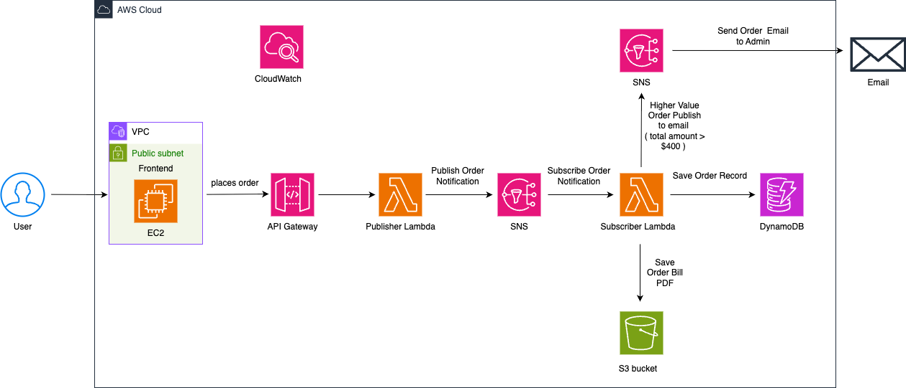

# 🍽️ Restaurant Ordering System

A full-stack, cloud-native application for digital restaurant ordering. The system features a React frontend hosted on AWS EC2 and a serverless backend using AWS Lambda, API Gateway, DynamoDB, S3, and SNS.

---

## 📝 Project Overview

The **Restaurant Ordering System** streamlines dine-in restaurant operations by enabling customers to place orders digitally and automating backend processes such as order processing, bill generation, and real-time notifications. The solution is designed for scalability, cost-efficiency, and security, leveraging a hybrid AWS architecture that combines EC2-hosted frontend with serverless backend services. The entire infrastructure is provisioned using AWS CloudFormation for repeatable and reliable deployment.

---

## 🎯 Key Features

- **Contactless Digital Ordering:** Customers browse the menu and place orders via a web platform.
- **Automated Order Processing:** Orders are handled in real-time by backend Lambda functions and stored in DynamoDB.
- **PDF Bill Generation:** Each order triggers automatic bill creation as a PDF, stored securely in S3.
- **Real-Time Notifications:** High-value orders trigger email alerts to admins using SNS.
- **Secure and Scalable:** Data is encrypted in transit and at rest; the system auto-scales for varying loads.

---

## 🏗️ Architecture



**Frontend**
- React.js single-page application
- Hosted on AWS EC2 (NGINX) within a secure VPC

**Backend**
- AWS Lambda (Python): Stateless, event-driven order processing and PDF bill generation
- Amazon API Gateway: RESTful endpoint for frontend-backend communication
- Amazon DynamoDB: NoSQL database for order/session management
- Amazon S3: Storage for generated PDF bills
- Amazon SNS: Notifications for workflow triggers and admin alerts
- Amazon CloudWatch: Centralized monitoring and logging

---

## 🛠️ Technologies Used

- **Frontend:** React.js, NGINX, EC2, AWS VPC
- **Backend:** AWS Lambda (Python), API Gateway, DynamoDB, S3, SNS
- **Infrastructure as Code:** AWS CloudFormation
- **Monitoring:** Amazon CloudWatch
- **Secrets Management:** AWS Systems Manager Parameter Store

---

## 🚀 Deployment

The application is deployed using a single AWS CloudFormation template, automating the setup of all required infrastructure.

### Prerequisites

- AWS CLI configured with appropriate permissions
- Node.js and npm installed (for frontend)
- Bash shell environment

### Deployment Steps

1. **Clone the repository**
 ```bash
git clone https://github.com/bindumalavika/Restaurant.git
cd Restaurant
```


2. **Deploy infrastructure using CloudFormation**
Run the deployment script
```bash 
chmod +x deploy.sh
./deploy.sh
```

3. **After deployment, the script will output**
- The URL of the web application
- The URL of the CloudWatch dashboard for monitoring

4. **Access the application**
- Open the provided web application URL in your browser to use the system.
- Use the CloudWatch dashboard URL to monitor logs and application health.

---

## 📁 Project Structure
```
Restaurant/
├── frontend/                  # React app source
│   ├── public/
│   ├── src/
│   ├── package-lock.json
│   └── package.json
├── images/                    # Project images and diagrams
│   └── architecture-diagram.png
├── infrastructure/            # Infrastructure as Code and Lambda layers
│   ├── lambda-layer/
│   │   └── python.zip
│   └── restaurant-ordering-IAC.yaml
├── .gitignore
├── deploy.sh                  # Deployment script
└── README.md                  # Project documentation
```

---

## 🔐 Data Security

- **Encryption at Rest:** S3 and DynamoDB use AES-256 server-side encryption.
- **Encryption in Transit:** All communications via HTTPS.
- **Secrets Management:** Sensitive configuration via AWS SSM Parameter Store.
- **Network Isolation:** EC2 and backend resources run in a VPC with strict security groups.
- **Monitoring:** CloudWatch for real-time logs and alerts.

--- 
> *This project demonstrates a modern, cloud-native approach to restaurant order management, combining the flexibility of EC2-hosted frontends with the scalability and efficiency of serverless AWS backends. The architecture is designed for easy expansion, robust security, and minimal operational overhead—making it suitable for both academic and real-world deployment.*

---
